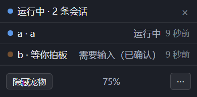

<h1 align="center">淘淘 · 桌面宠物</h1>

<p align="center">
  <b>把 AI agent 的工作状态，变成 Windows 桌面上一只可以逗的宠物。</b><br>
  <sub>个人项目 · 非官方 · 仅 Windows</sub>
</p>

<p align="center">
  <a href="LICENSE"></a>
  
  
  
  
</p>

---

跑着 agent 的时候，桌面上有只狗替你看进度：**它在跑就来回踱步，需要你回话就举手弹气泡，没人理它就趴下打盹。** 你不用切窗口瞄一眼终端，就知道"现在到哪一步了"。

<table>
  <tr>
    <td width="34%" align="center"><br><sub>就待在桌面上，不抢你焦点</sub></td>
    <td width="33%" align="center"><br><sub>要你回话时冒气泡，角标计会话数</sub></td>
    <td width="33%" align="center"><br><sub>右键唤出：状态 + 手动把玩</sub></td>
  </tr>
</table>

<sub>上图均为本仓库真实运行截图。</sub>

## 30 秒看懂

| 你在做的事 | 淘淘的反应 |
|---|---|
| 开着 agent 但没下文 | 趴着打盹 |
| agent 正在跑 | 原地踱步，偶尔换个方向 |
| agent 要你确认 / 回答 | **举手 + 冒气泡**「需要输入」，多会话时角标显示 `+N` |
| 你手动点了某个动作 | 照演，**跟 agent 状态完全无关**——它是宠物，不是状态栏 |
| 你开了全屏游戏 / 视频 | 自动藏起来，退出全屏再回来 |

**给谁用**：同时跑多个 AI agent、经常需要盯着"哪个还在跑、哪个卡在等我"的人。

**它不是什么**：不是 Live2D 播放器，不依赖任何 agent 客户端，也不是某家产品的官方插件。它是一个**自己写的运行时**，用 Electron 透明窗口把精灵图集一帧帧画在桌面上。

## 装上它

> **先说清楚现状**：这个仓库目前**没有公开发布的预编译包**（GitHub Release 是空的），因为产物有 164 MB，我不想随便往公开仓库丢这么大的二进制。
> 下面给你两条路：**要现成的**找作者要 zip；**愿意自己构建**的按「从源码跑」走，全程 3 分钟。

### 方式一：拿现成的（免安装绿色版）

1. 拿到 `desktop-pet-1.0.1-win-x64.zip`；
2. **整个解压**到一个固定位置（别放"下载"文件夹，也别放会被清理的临时目录）；
3. 双击 `desktop-pet.exe`；
4. 托盘出现宠物图标：**左键单击 = 收起/放出**，**右键 = 完整菜单**。

**三个必须知道的坑：**

- ⚠️ **`desktop-pet.exe` 不能单独拷走。** 它只是入口，启动时要在同级目录找 `resources/`、`*.dll`、`*.pak`、`locales/`。**要拷就拷整个解压出来的目录。**
- ⚠️ **未签名 exe 首次运行会被 SmartScreen 拦。** 点「更多信息 → 仍要运行」放行。
- ⚠️ **开了开机自启之后别再移动这个目录。** 注册表里记的是绝对路径，移动后自启会失效——在新位置双击一次 `desktop-pet.exe` 即可自动修正。

### 方式二：从源码跑

要求 **Node 22**、Windows x64。

> 开发与验证用的是 **Node 22.13.1 / Windows x64**。**更低版本未验证过**——本仓库的规矩是"平台行为一律实测、不推断"，所以这里不写一个没测过的最低版本号。

```bash
npm ci
npm run build        # 完整构建（只跑 tsc 不够，渲染层还要过 esbuild）
npm start            # = electron .
```

想出绿色版 / 分发 zip：

```bash
npm run make:portable        # 只出目录 → dist-win/desktop-pet/
npm run make:portable:zip    # 顺带压成一个 zip（对外分发用这一个）
```

> 打包脚本**只复制 `dist/`，它自己不构建**——所以必须先 `npm run build`。

<details>
<summary><b>让它动起来：手工喂几个状态看看（开发者 / 想看效果的人）</b></summary>

宠物自己不产生状态，状态从 agent 那边来。想看它动，仓库里带了一个人工验收入口：

```bash
node tools/pet-hook.mjs needs-input --session=demo --title="等你确认"
node tools/pet-hook.mjs running    --session=demo
node tools/pet-hook.mjs idle       --session=demo
```

Windows 上也可以双击 `喂状态.bat`（上面命令的图形版）。真实接入有两条通道——**hook 命令**（事件驱动，实时）与**状态文件**（快照轮询，默认在 `~/.desktop-pet/status.json`）。契约见 [`docs/constraints/sources-hooks.md`](docs/constraints/sources-hooks.md)，操作手册见 [`docs/how-to-run.md`](docs/how-to-run.md)。

</details>

## 它凭什么不一样

**自研运行时，不绑任何客户端。** 不依赖 Codex / ChatGPT，也不依赖某个 agent 的插件机制。它解析的是一份公开的宠物包规格（精灵图集 + `pet.json` + 行为映射），所以任何 agent 只要能往一个文件里写状态，就能接上。

**内核不碰 Electron，所以能纯函数单测。** 状态仲裁、动画映射、行为层、命中判定全部收在 `src/kernel/`，宿主差异收在 `src/host/`。这意味着**逻辑正确性是 446 项断言在跑，不用起窗口、不用肉眼**。

**判据是实测出来的，不是推断的。** 项目的硬规矩是"平台行为一律实测"——这条是被实测推翻过六次之后才立起来的。真实窗口层面的验证（真窗口、真鼠标注入、真像素读数）在 `spikes/` 下，**探针结论会进 ADR，不会只留在脑子里**。

**它守住了几条硬边界：**

- **不抢焦点**——窗口全程 `WS_EX_NOACTIVATE`，不会打断你正在做的事；
- **只有宠物本身可点**——逐像素 alpha 命中判定，精灵轮廓外一律穿透到桌面，窗口"看着大"但不吃掉旁边的点击；
- **全屏自动让位**——检测到全屏应用就藏起来；
- **能关得掉**——托盘右键一键退出；开机自启写 `HKCU\...\Run`，可开关，**不写服务、不写计划任务**。

## 它不做什么

说清楚边界比罗列功能有用：

- **只支持 Windows**。核心依赖 Win32 分层窗口、`WS_EX_NOACTIVATE`、逐像素命中判定。
- **多显示器不跨屏漫游**。宠物只在自己那块屏里走，不会窜到另一块屏上。
- **没有 macOS / Linux 版**，也没有在做。
- **预编译包目前不公开发布**（见上文「装上它」）。
- **单显示器多屏用户注意**：动了显示器配置后，宠物可能停在看不见的那块屏上——托盘图标右键可以把它唤回来。

## 换一只宠物

外观来自一个**宠物包**：一张精灵图集 + `pet.json` + `behavior-map.json`。

- 规格说明：[`pet-spec.html`](pet-spec.html)
- 校验：`python tools/validate_pet.py`
- 生成空白模板：`python tools/make_pet_template.py`

**换宠物包不需要改代码**——只要图集尺寸与 `pet.json` 里的 `spriteVersionNumber` 对得上。

## 文档在哪

这个工程的文档密度比一般个人项目高，因为它**是按"能被下一个会话接上"来组织的**：

| 文件 | 作用 |
|---|---|
| [`PLAN.md`](PLAN.md) | 接续入口：现在到哪了、下一步做什么、细节去哪找 |
| [`AGENTS.md`](AGENTS.md) | 开工约定与约束路由表（按"你要改什么"指向对应约束） |
| [`docs/decisions/INDEX.md`](docs/decisions/INDEX.md) | 决策档案一行一条（ADR 全文在同目录，只增不改） |
| [`docs/how-to-run.md`](docs/how-to-run.md) | 操作手册：启动、托盘、气泡、控制条、动作排 |
| [`docs/acceptance.md`](docs/acceptance.md) | 人工验收清单 |
| [`docs/constraints/`](docs/constraints/) | 硬约束（探针判据、状态源契约等） |
| [`journal/`](journal/) | 每次会话的日志 |

踩过的坑基本都写进了 ADR 与约束文件。想知道某个设计**为什么**这么做，去 `docs/decisions/` 翻对应编号。

<details>
<summary><b>代码结构与测试（开发者）</b></summary>

```
src/
├── kernel/     纯 TS 内核：状态仲裁、动画映射、播放器、行为层、手动把玩（不 import Electron）
├── source/     状态源适配器：hook / 状态文件 → 统一事件
├── host/       宿主适配层：窗口、托盘、气泡、控制条、全屏检测、自启
├── main/       主进程装配（boot 的每一段都有索引注释）
└── renderer/   精灵图渲染 / 气泡 / 控制条面板
```

```bash
npm run typecheck      # tsc，主进程 + preload 双份
npm run test:status    # 行为与判据：446 项断言
npm run check:timers   # 定时器生命周期静态检查（每条 interval 的句柄都必须被接住）
```

真实窗口层面的验证在 `spikes/` 下，各目录有自己的 README。它们是**探针**：启动真实 Electron 窗口、注入真实鼠标、量真实读数，而不是断言 DOM 猜出来的。

</details>

## 许可证

**代码：[MIT](LICENSE)。**

**演示素材不在授权范围内。** 仓库里的 `spritesheet.webp`、`examples/`、`assets/pet_atlas_guide_*.png`、`assets/tray.ico`、`pet-spec.html`、`atlas-map.png` 等美术与规格素材，是**为了让人能直接跑起来而随附的演示资源**，仅用于展示宠物的外观与动画规格。

如果你要基于本项目做自己的作品，**请换成你自己拥有权利的素材**（用 `python tools/make_pet_template.py` 生成模板即可）。
