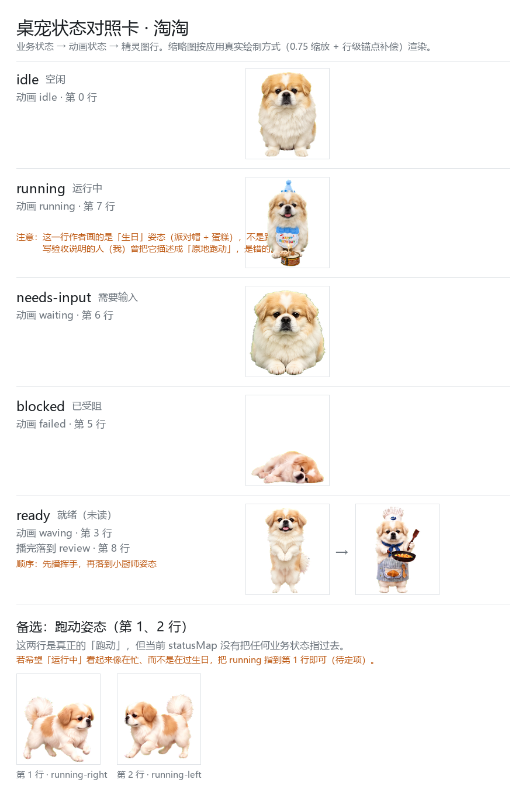

<h1 align="center">桌面宠物软件 - 淘淘</h1>

<p align="center">
  <b>一只住在 Windows 桌面上的狗，替你盯着 AI agent 干到哪一步了。</b><br>
  <sub>个人项目 · 非官方 · 仅 Windows</sub>
</p>

<p align="center">
  
  
  
</p>

<p align="center">
  
</p>

---

## 它替你盯着什么

你同时开着几个 agent 的时候，最烦的不是等，是**不知道自己在等哪个**。

淘淘看你的 agent 状态，然后待在桌面上用动作告诉你：

- **在跑** —— 它端着蛋糕到处晃（就是它画在图里的「运行中」，见下方对照卡）
- **等你回话** —— 它举手，冒一个气泡，多个会话同时等就显示 `+N`
- **卡住了** —— 它趴下
- **没事干** —— 它打盹
- **你点了全屏** —— 它自己藏起来，退出全屏再回来

<p align="center">
  
  <br>
  <sub>它的全部状态。缩略图按应用真实绘制方式渲染，卡上看到的就是屏幕上看到的。</sub>
</p>

## 三个让你愿意一直开着的细节

**它不打断你。** 窗口全程不抢焦点，鼠标移到它轮廓外就穿透到桌面去了 —— 不会挡住你点别的窗口。你正在写东西，它在背后踱步，你完全感觉不到它。

**它全屏让路。** 你打开游戏或视频，它自动消失，退出全屏再回来。

**它能干净地关掉。** 托盘图标一键退出，开机自启可以随时关，不写服务也不写计划任务。

## 装上它

> 仓库目前**没有公开发布的预编译包**（安装包 164 MB，我不想随手往公开仓库丢这么大的二进制）。
> 要现成的找作者要压缩包；愿意自己装的全程 3 分钟。

1. 拿到压缩包，**整个解压**到一个固定位置 —— 别放「下载」文件夹，也别放会被系统清理的临时目录
2. 双击里面的 `desktop-pet.exe`
3. 托盘出现一个图标：**单击 = 收起／放出**，**右键 = 菜单**

**三件容易踩的事：**

- **那个 exe 不能单独拿走。** 它只是入口，还得靠同级目录里的其他文件才能起来。**要搬就整个目录一起搬。**
- **第一次双击会被 Windows 拦一下**（没买证书签名）。点「更多信息」→「仍要运行」放行。
- **开了开机自启就别再挪这个文件夹了。** 自动启动记的是它的完整位置；真挪了，到新位置双击一次 exe 就修好了。

<details>
<summary><b>从源码运行</b></summary>

需要 **Node 22**、Windows x64。

```bash
npm ci
npm run build        # 完整构建（只跑 tsc 不够，渲染层还要过 esbuild）
npm start            # 启动
```

打包成免安装绿色目录 / zip：

```bash
npm run make:portable        # 只出目录 → dist-win/desktop-pet/
npm run make:portable:zip    # 顺带压成一个 zip（对外分发用这一个）
```

> 打包脚本**只复制 `dist/`，它自己不构建** —— 所以必须先 `npm run build`。

</details>

## 它不是什么

说清楚边界比罗列功能有用：

- **它就是淘淘。** 这是为淘淘做的软件，不是一个能换任意宠物的通用框架。
- **只支持 Windows**，没有 macOS / Linux 版，也没在做。
- **多显示器不跨屏漫游** —— 淘淘只在自己那块屏里走。动过显示器配置后它可能停在看不见的屏上，托盘图标右键可以唤回来。
- **不是 Live2D 播放器**，也不依赖 Codex / ChatGPT 或任何 agent 客户端。

---

<details>
<summary><b>开发者：架构、测试、文档</b></summary>

### 架构

内核刻意不碰 Electron —— 状态仲裁、动画映射、行为层、命中判定全在 `src/kernel/`，
宿主差异收在 `src/host/`。所以逻辑正确性是纯函数单测在跑，不用起窗口、不用肉眼。

```
src/
├── kernel/     纯 TS 内核：状态仲裁、动画映射、播放器、行为层、手动把玩
├── source/     状态源适配器：hook / 状态文件 → 统一事件
├── host/       宿主适配层：窗口、托盘、气泡、控制条、全屏检测、自启
├── main/       主进程装配
└── renderer/   精灵图渲染 / 气泡 / 控制条面板
```

### 怎么喂状态

淘淘自己不产生状态，状态从 agent 那边来。想看它动：

```bash
node tools/pet-hook.mjs needs-input --session=demo --title="等你确认"
node tools/pet-hook.mjs running    --session=demo
node tools/pet-hook.mjs idle       --session=demo
```

Windows 上也可以双击 `喂状态.bat`。真实接入有两条通道 —— **hook 命令**（事件驱动，实时）
与**状态文件**（快照轮询，默认 `~/.desktop-pet/status.json`）。

### 测试

```bash
npm run typecheck      # 主进程 + preload 双份类型检查
npm run test:status    # 行为与判据：446 项断言
npm run check:timers   # 定时器生命周期静态检查
```

真实窗口层面的验证在 `spikes/` 下 —— 启动真实窗口、注入真实鼠标、量真实读数，
而不是断言 DOM 猜出来的。**改完动过界面的代码，判据在 `docs/constraints/build-probe.md`。**

### 改淘淘的外观

外观来自一份宠物包：精灵图集 `spritesheet.webp` + `pet.json` + `behavior-map.json`。
格式是照着 Codex / ChatGPT 的宠物包规格做的。**但这不等于支持换宠物** ——
内部实现依然读那个格式，只是没有、也不打算做成「下载任意宠物包就能换」的平台。

- 规格说明：[`pet-spec.html`](pet-spec.html)
- 校验：`python tools/validate_pet.py`
- 生成空白模板：`python tools/make_pet_template.py`
- 重新生成上面那张状态对照卡：`python tools/make-status-reference.py`

改完记得让图集尺寸与 `pet.json` 里的 `spriteVersionNumber` 对得上。

### 文档

这个工程的文档密度比一般个人项目高，因为它**是按「能被下一个会话接上」来组织的**：

| 文件 | 作用 |
|---|---|
| [`PLAN.md`](PLAN.md) | 接续入口：现在到哪了、下一步做什么 |
| [`AGENTS.md`](AGENTS.md) | 开工约定与约束路由表 |
| [`docs/decisions/INDEX.md`](docs/decisions/INDEX.md) | 决策档案一行一条（全文在同目录，只增不改） |
| [`docs/how-to-run.md`](docs/how-to-run.md) | 操作手册 |
| [`docs/acceptance.md`](docs/acceptance.md) | 人工验收清单 |
| [`journal/`](journal/) | 每次会话的日志 |

想知道某个设计**为什么**这么做，去 `docs/decisions/` 翻对应编号。

</details>

## 许可证

**代码：[MIT](LICENSE)。**

**演示美术素材不在授权范围内。** 仓库里的 `spritesheet.webp`、`examples/`、
`assets/pet_atlas_guide_*.png`、`assets/tray.ico`、`pet-spec.html`、`atlas-map.png`
等美术与规格素材，是为了让人能直接跑起来而随附的演示资源。

如果你要基于本项目做自己的作品，**请换成你自己拥有权利的素材**
（用 `python tools/make_pet_template.py` 生成模板即可）。
